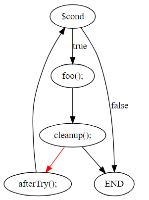

# Sonar-PHP Control Flow Graph

## Definition

A CFG is a graph of [basic blocks](https://en.wikipedia.org/wiki/Basic_block) (from now on, we will use the term 'block'), where block is sequence of statements executed linearly without branching.

### Blocks

#### Block attributes

* successors - set of blocks that are executed after specific block
* predecessors - set of blocks that are executed before specific block
* syntactic successor
  - an imaginary successor which exists only for blocks ending with unconditional jumps (`break`, `continue`, `return`, `goto`, `throw`)
  - it is the "normal" successor in case the jump would be omitted
  - for non-jump blocks, it is `null`
* elements
  - list of statements (represented as AST node) inside the block which are executed sequentially
  - `return` or jump like `break`, `continue` will be the last statement in the elements list

#### Block types

Different implementations of blocks:

* Simple block - one or multiple successors
* Branching block
  - has 2 successors - one TRUE successor and one FALSE successor
  - contains the branching tree - e.g. IfStatementTree or loop trees
* End block - no successors

### Statements

Statements that are considered for building blocks:

* `try`,  `throw`,  `return`, `break`,  `continue`,  `goto`,  `label`, `do-while`, `while`, `for`,  `foreach`, `if`, `switch`

Every other statement will be added as element to the containing block (including ternary expressions).

In other words, we do not explore the expressions inside the above statements when building the CFG, we just add them to the list of elements.

## Implementation

The CFG  is built using bottom-up approach. This means that we start with empty END block (bottom), which represents end of the control flow in the current function and we process backwards all the statements in the block recursively. Algorithm is implemented as an AST visitor in [ControlFlowGraphBuilder](php-frontend/src/main/java/org/sonar/php/cfg/ControlFlowGraphBuilder.java)

CFG is built for following kinds of trees: SCRIPT, FUNCTION_DECLARATION, FUNCTION_EXPRESSION, METHOD_DECLARATION.

### For Loop
The `for` statement creates multiple blocks:

- one for initialization of variables (before body)
- one for the body of the for
- one for update (following the body)
- one for the condition

### Switch

The SWITCH statement is modelled as multiple `if-elseif-else` blocks. Interesting feature of `switch` statement in PHP is the fact that `continue` inside switch behaves the same as `break` statement ([see manual](http://php.net/manual/en/control-structures.continue.php))

### Try Catch Finally

We made several assumptions to simplify construction of CFG for `try-catch-finally` construct

* To limit the number of blocks and edges in the graph, the whole `try` body is treated as single block with `catch` and `finally` treated as successors of this block. Note however that every statement in the body could raise an exception and exit the block. It is up to the analysis using the CFG to take into consideration that the body may not be executed as a whole.
* If the `finally` clause is missing, we assume that an empty `finally` clause is present to simplify the construction of CFG. 
* We always assume that it is possible that an exception is not handled by any present `catch` clause, even if there is `catch` clause handling all `Exception` types. In particular this means that there is always a path to the `END` block (visiting all enclosed `finally` blocks on the way)

### Limitations

#### Empty blocks

During the construction of the CFG it might happen that some empty blocks are created (e.g. empty `finally` clause, ...). We have a mechanism to cleanup these empty blocks, however it is limited that it can only remove empty blocks with one predecessor and one successor. If an empty block has multiple successors (which happens often with `try-catch-finally` statements) it is not removed.

#### Impossible paths from `finally`

Because we are building using bottom-up approach, we will construct the `finally` block before we construct the block for the `try` body. This `finally` block will have two successors:

1. "exceptional" successor representing the path for the unhandled exception connecting it to the outer `finally` clause or  `END` block.
2.  "normal" successor to the statement following the `try` statement.

This "normal" successor can be infeasible in case when there is an abrupt termination of the control flow like using `return` or `break` in the try body. Consider the following example

```php
while ($cond) {
    try {
        foo();
        break;
    } finally {
        cleanup();
    }
    afterTry();
}
```


Our CFG will look like this




Notice that red edge is actually impossible, but it will be present in the CFG due to this limitation.

## Tests

The best documentation is Test Automation, see [ControlFlowGraphTest](php-frontend/src/test/java/org/sonar/php/cfg/ControlFlowGraphTest.java).
